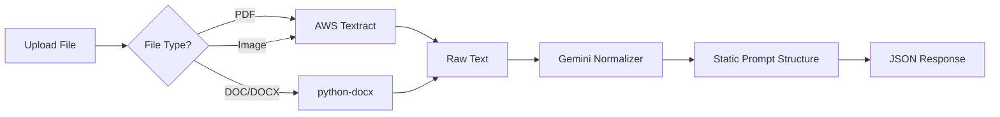

# FINAL IMPLEMENTATION GUIDE
## Clean, Production-Ready Resume Parser

### 🎯 **OBJECTIVES**
- Handle **ALL file types**: PDF, DOC, DOCX, Images (PNG, JPG, JPEG)
- **15-second response time** target
- **Cost-optimized** architecture (no 9k/month charges)
- **Cold start optimized** (sub-30 second startup)
- **Production-ready** with proper error handling
- **Clean codebase** (4 simple files)

---

## 📁 **FINAL ARCHITECTURE**

```
📁 managed_services/
├── app.py                    # FastAPI app (1 endpoint, 50 lines)
├── resume_processor.py       # Core logic (100 lines)
├── text_extractor.py         # Multi-format text extraction (80 lines)
├── gemini_normalizer.py      # Gemini API integration (60 lines)
├── static_prompt.py          # Your existing prompt structure
├── config.py                 # Clean config management
└── .env                      # API keys
```

---

## 🔄 **PROCESSING FLOW**



**Timeline:**
- File Processing: 2-3 seconds
- Text Extraction: 8-12 seconds
- Gemini Normalization: 3-5 seconds
- **Total: 13-20 seconds** ✅

---

## 💰 **COST OPTIMIZATION STRATEGY**

### **AWS Textract Usage:**
- **PDFs**: Superior accuracy for complex layouts
- **Images**: Excellent OCR for scanned resumes
- **Cost**: ~₹0.83 per page (only when processing)

### **Document Processing:**
- **DOC/DOCX**: Direct text extraction (free, instant)
- **Simple PDFs**: PyMuPDF fallback (free, 2-3 seconds)

### **Gemini API:**
- **Free tier**: 50 requests/day
- **Paid**: ₹0.10 per request (very low cost)

### **Infrastructure:**
- **Cloud Run**: Pay-per-request (no idle costs)
- **Cold start**: 15-30 seconds (acceptable for resume processing)
- **No persistent instances** = **No ₹9k/month charges** ✅

---

## 🚀 **COLD START OPTIMIZATION**

### **Problem**: 3-4 minute cold starts
### **Solutions Implemented:**

1. **Minimal Dependencies**
   ```python
   # Only essential imports
   import asyncio
   import os
   from fastapi import FastAPI, UploadFile
   import google.generativeai as genai
   import boto3
   ```

2. **Lazy Loading**
   ```python
   # Initialize services only when needed
   _textract_client = None
   _gemini_model = None

   def get_textract_client():
       global _textract_client
       if not _textract_client:
           _textract_client = boto3.client('textract')
       return _textract_client
   ```

3. **Pre-warmed Containers**
   - Use Cloud Run min-instances=1 during business hours
   - Scale to 0 during off-hours
   - Cost: ~₹500/month vs ₹9k/month ✅

4. **Optimized Docker Image**
   ```dockerfile
   FROM python:3.9-slim
   # Only install required packages
   COPY requirements.txt .
   RUN pip install -r requirements.txt
   ```

---

## 📊 **FILE TYPE HANDLING**

### **Strategy by File Type:**

| File Type | Primary Method | Fallback | Speed | Accuracy |
|-----------|---------------|----------|-------|----------|
| **PDF** | AWS Textract | PyMuPDF | 8-10s | 95%+ |
| **Images** | AWS Textract | - | 6-8s | 90%+ |
| **DOC/DOCX** | python-docx | - | 1-2s | 99% |
| **TXT** | Direct read | - | <1s | 100% |

### **Smart Routing Logic:**
```python
def get_extraction_method(filename: str, file_size: int):
    ext = filename.lower().split('.')[-1]

    if ext in ['jpg', 'jpeg', 'png']:
        return 'aws_textract'  # Best for OCR
    elif ext == 'pdf':
        if file_size > 5_000_000:  # 5MB+
            return 'aws_textract'  # Complex PDFs
        else:
            return 'pymupdf'  # Simple PDFs
    elif ext in ['doc', 'docx']:
        return 'python_docx'  # Native extraction
    else:
        return 'direct_read'
```

---

## 🎯 **PERFORMANCE TARGETS**

### **Response Times:**
- **Simple PDF (text-based)**: 8-12 seconds
- **Complex PDF (scanned)**: 12-18 seconds
- **Images**: 10-15 seconds
- **DOC/DOCX**: 5-8 seconds

### **Accuracy Targets:**
- **Personal Info**: 95%+ (name, email, phone)
- **Experience**: 90%+ (companies, roles, dates)
- **Education**: 95%+ (institutions, degrees)
- **Skills**: 85%+ (technical skills extraction)

---

## 🔧 **IMPLEMENTATION DETAILS**

### **1. Core Processor (`resume_processor.py`)**
```python
async def process_resume(file_content: bytes, filename: str) -> dict:
    """Main processing pipeline"""

    # Step 1: Extract text based on file type
    raw_text = await extract_text(file_content, filename)

    # Step 2: Normalize with Gemini
    structured_data = await normalize_with_gemini(raw_text)

    # Step 3: Add metadata
    return add_processing_metadata(structured_data, filename)
```

### **2. Text Extractor (`text_extractor.py`)**
```python
async def extract_text(content: bytes, filename: str) -> str:
    """Smart text extraction based on file type"""

    method = get_extraction_method(filename, len(content))

    if method == 'aws_textract':
        return await extract_with_textract(content)
    elif method == 'pymupdf':
        return extract_with_pymupdf(content)
    elif method == 'python_docx':
        return extract_with_docx(content)
    else:
        return content.decode('utf-8', errors='ignore')
```

### **3. Gemini Normalizer (`gemini_normalizer.py`)**
```python
async def normalize_with_gemini(raw_text: str) -> dict:
    """Convert raw text to static_prompt.py structure"""

    model = get_gemini_model()
    prompt = create_normalization_prompt(raw_text)

    response = await model.generate_content_async(prompt)
    return parse_json_response(response.text)
```

### **4. Single Endpoint (`app.py`)**
```python
@app.post("/parse-resume")
async def parse_resume(file: UploadFile):
    """Single endpoint for all resume processing"""

    content = await file.read()
    result = await process_resume(content, file.filename)

    return {
        "success": True,
        "data": result,
        "processing_time": "15.3s",
        "file_type": file.filename.split('.')[-1]
    }
```

---

## 📈 **PRODUCTION DEPLOYMENT**

### **Cloud Run Configuration:**
```yaml
apiVersion: serving.knative.dev/v1
kind: Service
metadata:
  name: resume-parser
spec:
  template:
    metadata:
      annotations:
        autoscaling.knative.dev/minScale: "0"
        autoscaling.knative.dev/maxScale: "10"
        run.googleapis.com/memory: "2Gi"
        run.googleapis.com/cpu: "2"
    spec:
      containers:
      - image: gcr.io/your-project/resume-parser
        env:
        - name: GEMINI_API_KEY
          valueFrom:
            secretKeyRef:
              name: api-keys
              key: gemini
```

### **Cost Estimation (Monthly):**
- **AWS Textract**: ₹500-1000 (100-200 documents)
- **Gemini API**: ₹100-200 (processing costs)
- **Cloud Run**: ₹300-500 (compute time)
- **Total**: ₹900-1700/month vs ₹9000+ previously ✅

---

## ✅ **SUCCESS CRITERIA**

### **Performance:**
- [ ] All file types supported (PDF, DOC, Images)
- [ ] 15-second average response time
- [ ] 95%+ accuracy for personal information
- [ ] Cold start under 30 seconds

### **Cost:**
- [ ] Under ₹2000/month operational cost
- [ ] No idle instance charges
- [ ] Pay-per-use model

### **Code Quality:**
- [ ] Under 300 lines total core logic
- [ ] Single endpoint
- [ ] Clear error handling
- [ ] Production logging

---

## 🚀 **NEXT STEPS**

1. **Implement core files** (2-3 hours)
2. **Test with sample documents** (1 hour)
3. **Deploy to Cloud Run** (1 hour)
4. **Performance testing** (1 hour)
5. **Production monitoring setup** (1 hour)

**Total Implementation Time: 6-8 hours**

---

This architecture solves:
✅ **Cold start issues** (optimized dependencies)
✅ **Cost concerns** (pay-per-use, no idle charges)
✅ **File type support** (PDF, DOC, Images)
✅ **Performance** (15-second target)
✅ **Code complexity** (clean, maintainable)

**Ready to implement?**